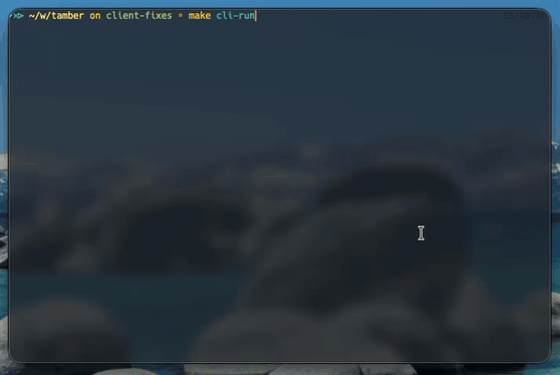

# Timbre

**A terminal-first text-to-music studio.**  
Compose multi-section tracks from prompts with a Rust TUI frontend and a Python inference backend.



[Quick Start](#quick-start) | [Tech Stack](#tech-stack) | [System Flow](#system-flow) | [Documentation](#documentation)

## Why Timbre

Timbre is built for fast idea-to-audio iteration. You can sketch structure, guide instrumentation, and render complete arrangements from one interactive terminal workflow while the backend handles planning, generation, and mastering.

## Tech Stack

| Layer | Tools |
| --- | --- |
| Terminal UI | [Rust](https://www.rust-lang.org/), [Ratatui](https://github.com/ratatui/ratatui), [crossterm](https://github.com/crossterm-rs/crossterm) |
| API + orchestration | [FastAPI](https://github.com/fastapi/fastapi), [Uvicorn](https://github.com/encode/uvicorn), [Pydantic](https://github.com/pydantic/pydantic) |
| Music inference | [PyTorch](https://github.com/pytorch/pytorch), [Transformers](https://github.com/huggingface/transformers), [MusicGen](https://github.com/facebookresearch/audiocraft) |
| Tooling | [uv](https://github.com/astral-sh/uv), [pytest](https://github.com/pytest-dev/pytest), [Ruff](https://github.com/astral-sh/ruff), [mypy](https://github.com/python/mypy) |

## System Flow

```text
Prompt + controls (CLI)
        |
        v
Ratatui client (Rust)
        |
        v
FastAPI worker (planner + orchestrator)
        |
        v
MusicGen section renders
        |
        v
Mix + normalize + export artifacts
```

Key behavior:
- Planner v3 generates section-aware `CompositionPlan` outputs for short and long form tracks.
- Orchestrator renders sections sequentially, carries motif context, and joins with controlled fades.
- CLI status mirrors backend progress and supports live slash-command tuning (`/duration`, `/model`, `/cfg`, `/seed`, `/reset`).

## Quick Start

1. Clone and bootstrap:
```bash
git clone <repo-url>
cd tamber
make setup
```

2. (Optional) install extras:
```bash
uv sync --project worker --extra dev
uv sync --project worker --extra inference
```

3. Run worker + terminal client:
```bash
# Terminal 1
make worker-serve

# Terminal 2
make cli-run
```

4. Point the CLI at a different worker if needed:
```bash
TIMBRE_WORKER_URL="http://192.168.1.20:8000" make cli-run
```

## Configuration

| Variable | Purpose |
| --- | --- |
| `TIMBRE_WORKER_URL` | CLI base URL for the worker (`http://localhost:8000` by default) |
| `TIMBRE_DEFAULT_MODEL` / `TIMBRE_DEFAULT_DURATION` | Startup defaults in the CLI |
| `TIMBRE_ARTIFACT_DIR` | Output destination for copied artifacts |
| `TIMBRE_INFERENCE_DEVICE` | Force `cpu`, `mps`, or `cuda` |
| `TIMBRE_EXPORT_SAMPLE_RATE`, `TIMBRE_EXPORT_BIT_DEPTH` | Worker mastering overrides |

Implementation details live in `worker/src/timbre_worker/app/settings.py` and `cli/src/config.rs`.

## Testing

```bash
make test
make lint

cargo test
uv run --project worker pytest
uv run --project worker ruff check
uv run --project worker mypy
```

## Repository Layout

```text
cli/            Ratatui application and HTTP client
worker/         FastAPI app, planner, orchestrator, backend adapters
docs/           Architecture, setup, testing playbooks, ADRs
docs/schemas/   JSON schemas synced with Rust/Python models
ios/            Experimental SwiftUI client
```

## Documentation

- `docs/architecture.md` — system topology and execution pipeline
- `docs/COMPOSITION.md` — composition + mix pipeline details
- `docs/setup.md` — environment and dependency setup
- `docs/testing/e2e.md` — end-to-end validation checklist
- `docs/adrs/` — architecture decision records
- `docs/schemas/README.md` — schema workflow guidance

## iOS Client (Experimental)

A SwiftUI client scaffold ships in `ios/` and mirrors core generation flows.

```bash
make ios-run
make ios-test
```

Optional overrides:
- `IOS_SIMULATOR="iPhone 15 Pro"`
- `WORKER_URL="http://192.168.1.20:8000"`
- `TIMBRE_IOS_TEAM_ID=ABCDE12345`

## Contributing

1. Create a branch and keep changes scoped (`cli:`, `worker:`, `docs:`).
2. Run `make lint` and `make test` before pushing.
3. Update docs/schemas for behavior changes.
4. Add an ADR for significant architectural decisions.

## License & Usage

This repository is private R&D. Confirm upstream model/license terms before redistributing weights or generated assets.
